# Respostas - Roteiro 2

## Parte A - TCP

### Pergunta 1

O que acontece se você iniciar o cliente antes do servidor? Por quê?

Resposta:

O cliente mostra erro de conexão recusada. Isso acontece porque o servidor ainda não está rodando na porta 5042 para aceitar a conexão. No TCP, o cliente precisa se conectar ao servidor antes de enviar as mensagens.

### Pergunta 2

Qual mecanismo do TCP garante que as mensagens cheguem na ordem?

Resposta:

O TCP usa números de sequência para organizar as mensagens na ordem certa. Se alguma mensagem não chegar, ele também consegue pedir o reenvio.

### Pergunta 3

O que acontece se dois clientes tentarem se conectar ao mesmo tempo? O código atual suporta isso?

Resposta:

O código atual não suporta dois clientes ao mesmo tempo. O servidor usa apenas um `accept()`, então ele aceita um cliente, atende esse cliente e depois encerra. Para atender vários clientes, seria necessário usar um laço para aceitar novas conexões.

### Evidências de teste

#### Java

Servidor:

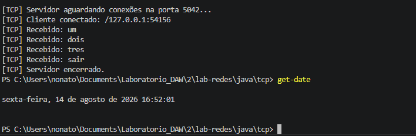

Cliente:

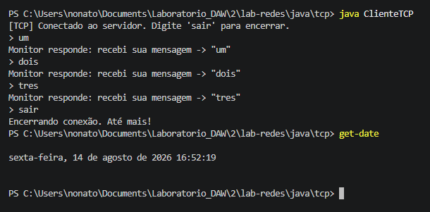

#### Python

Servidor:

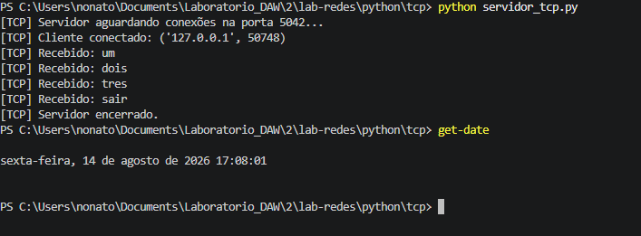

Cliente:

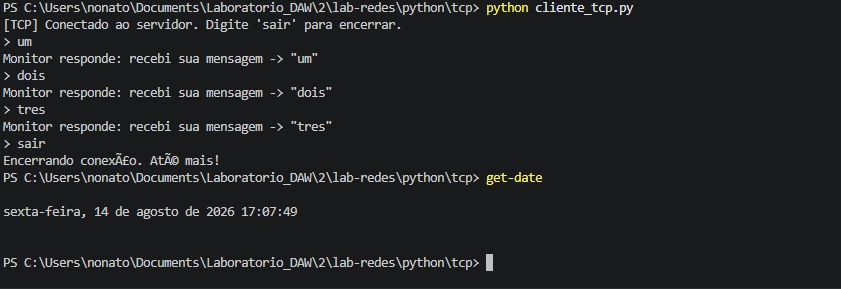

## Parte B - UDP

### Pergunta 1

O que aconteceu quando você enviou uma mensagem com o servidor desligado? Compare com o que aconteceria em TCP.

Resposta:

Com o servidor desligado, o cliente envia a mensagem, mas não recebe resposta. Isso acontece porque o UDP não cria uma conexão antes de enviar os dados. No TCP, o cliente mostraria erro de conexão recusada, pois ele precisa se conectar ao servidor antes de enviar a mensagem.

### Pergunta 2

Cite dois exemplos de aplicações reais que usam UDP e explique o motivo.

Resposta:

Um exemplo é o DNS, pois ele precisa responder rápido e uma pequena perda de pacote pode ser resolvida fazendo outra consulta. Outro exemplo são jogos online, pois é mais importante receber a informação mais recente rapidamente do que esperar uma informação antiga chegar.

### Pergunta 3

O servidor UDP não mantém registro de quem está conectado. Isso seria possível?

Resposta:

Seria possível guardar o endereço IP e a porta dos clientes que enviaram mensagens. Mesmo assim, o UDP continuaria sem conexão, pois o servidor apenas guardaria os dados de quem já mandou alguma mensagem.

### Evidências de teste

#### Java

Servidor:

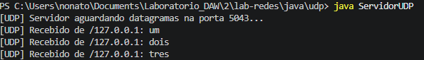

Cliente:

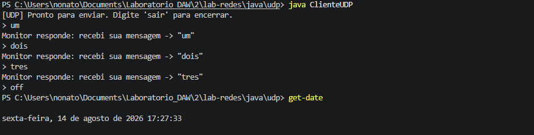

#### Python

Servidor:

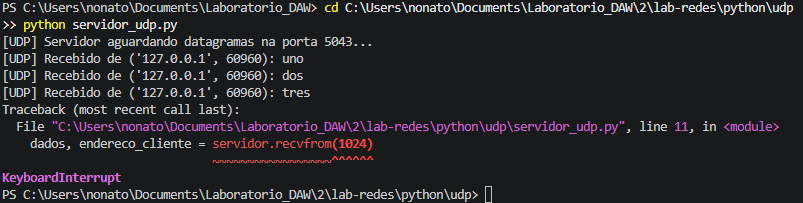

Cliente:

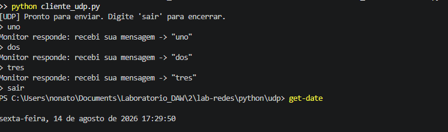

## Parte C - Multicast

### Pergunta 1

Qual é a diferença entre enviar a mesma mensagem para 3 clientes usando unicast e enviar uma única vez via multicast?

Resposta:

No unicast, o servidor precisa enviar a mesma mensagem 3 vezes, uma para cada cliente. No multicast, o servidor envia somente uma vez para o grupo e todos os clientes inscritos recebem a mensagem. Assim, o multicast usa menos tráfego na rede.

### Pergunta 2

O que é o TTL e por que ele é importante?

Resposta:

O TTL define até onde o pacote multicast pode chegar na rede. Ele é importante para não deixar a mensagem passar por várias redes sem necessidade.

### Pergunta 3

Se um cliente ficar offline e voltar depois, ele recebe os avisos que perdeu? Por quê?

Resposta:

Não recebe. O multicast envia a mensagem somente naquele momento e não guarda os avisos antigos para enviar depois. Quando o cliente volta, ele recebe apenas os próximos avisos.

### Evidências de teste

#### Java

Servidor:

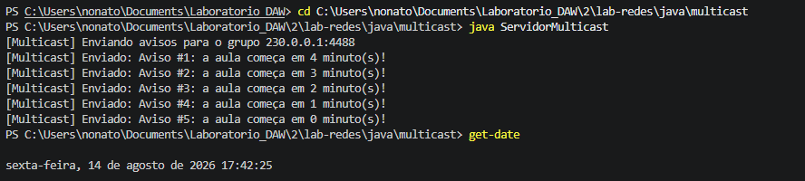

Cliente 1:

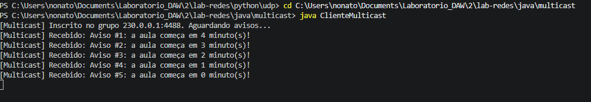

Cliente 2:

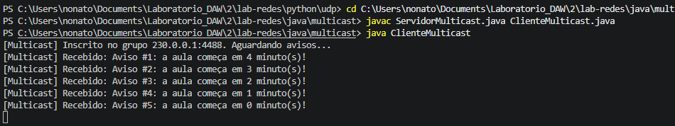

#### Python

Servidor:

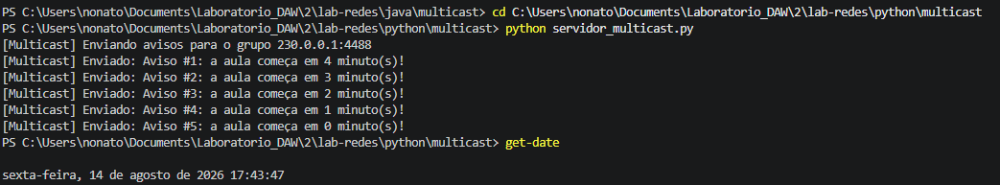

Cliente 1:

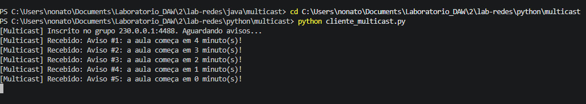

Cliente 2:

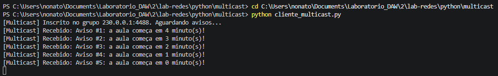

## Parte D - WebSocket

### Pergunta 1

O que muda na conexão depois que o handshake do WebSocket é concluído?

Resposta:

Depois do handshake, a conexão deixa de funcionar como uma requisição HTTP comum. Ela fica aberta e o servidor e o cliente podem enviar mensagens um para o outro a qualquer momento.

### Pergunta 2

Qual é a diferença entre o mural com WebSocket e o aviso com Multicast?

Resposta:

No WebSocket, o servidor sabe quais clientes estão conectados e envia a mensagem para cada um deles. No Multicast, o servidor envia uma mensagem para o grupo e todos que fazem parte desse grupo recebem o aviso.

### Pergunta 3

Por que o WebSocket é mais adequado que TCP cru para o mural em tempo real?

Resposta:

O WebSocket já tem uma forma padrão de trocar mensagens e funciona bem com navegadores. Com TCP cru, seria preciso criar a forma de enviar e organizar as mensagens. O WebSocket facilita criar um mural com vários clientes conectados.

### Evidências de teste

#### Java

Servidor:

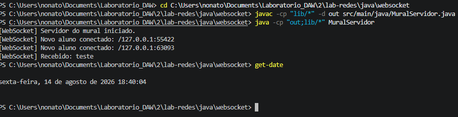

Cliente 1:

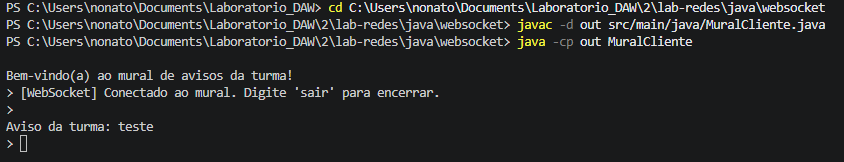

Cliente 2:

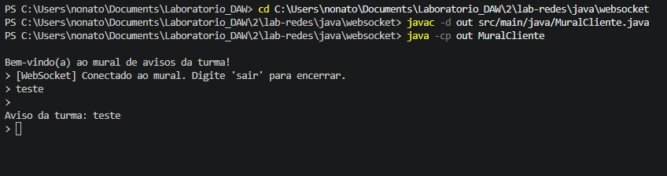

#### Python

Servidor:

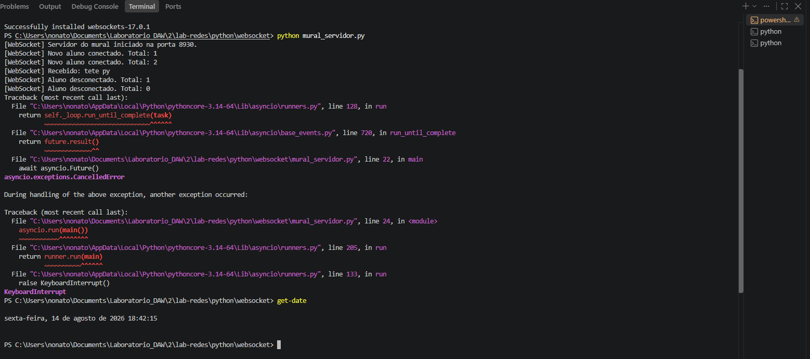

Cliente 1:

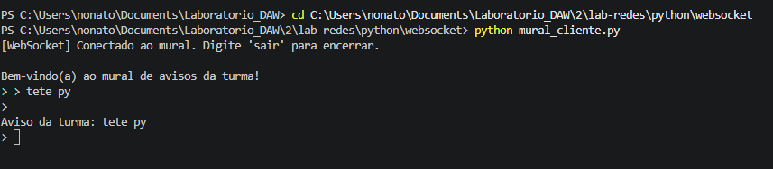

Cliente 2:

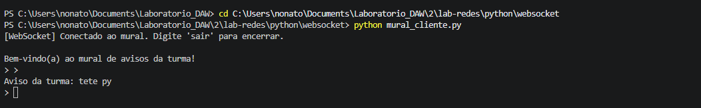
