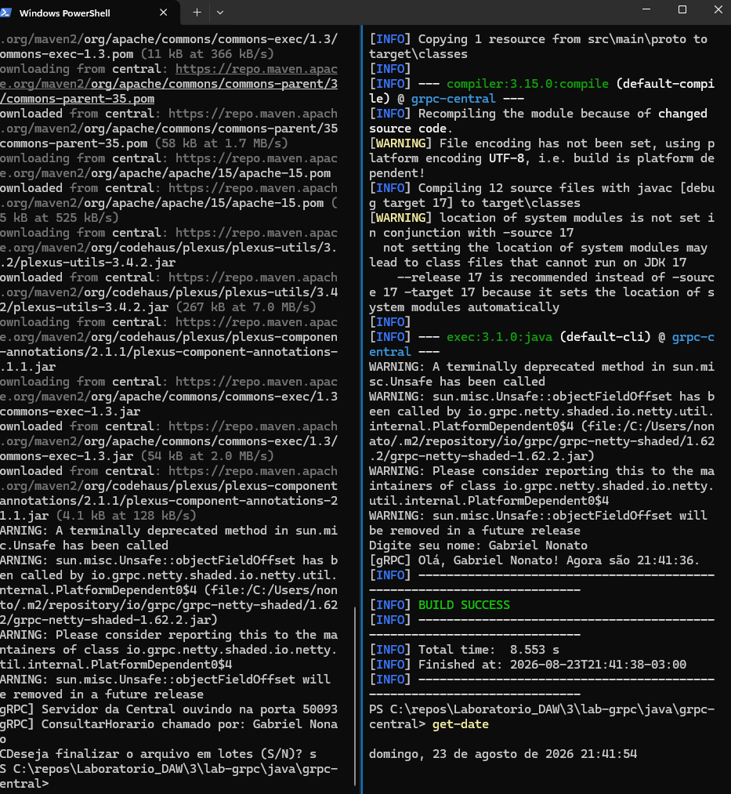
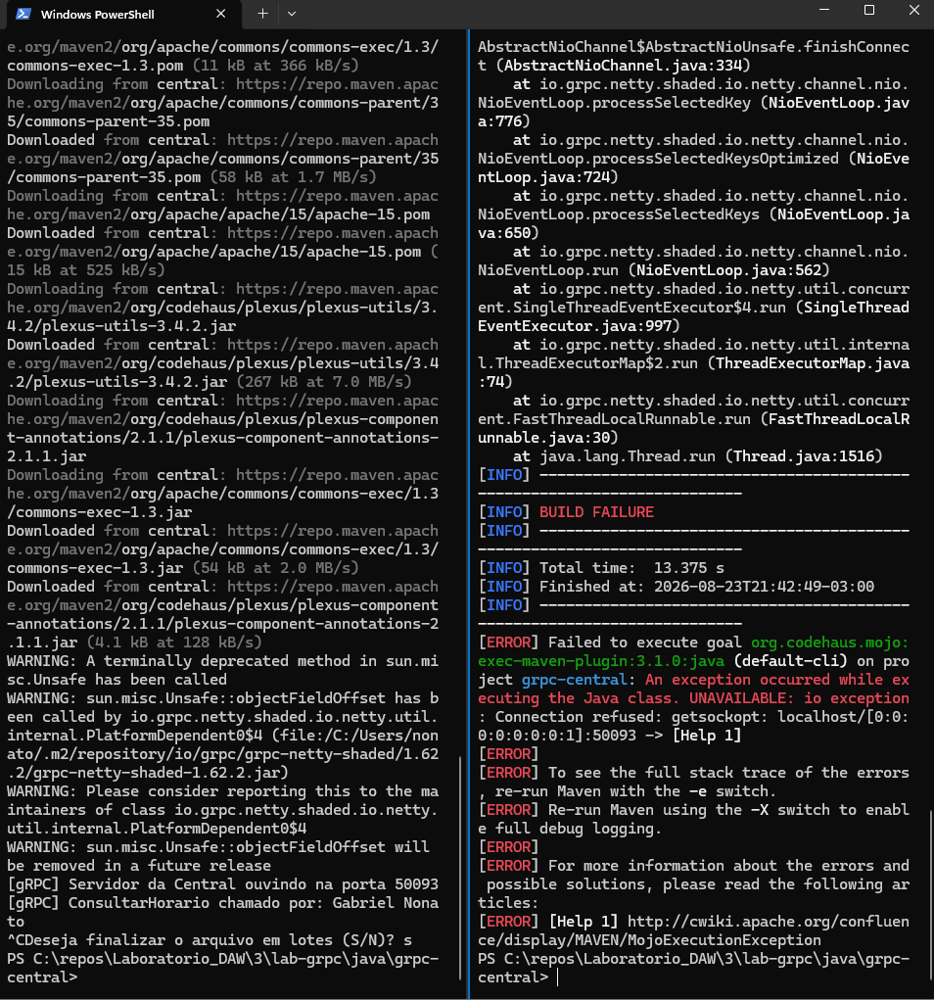
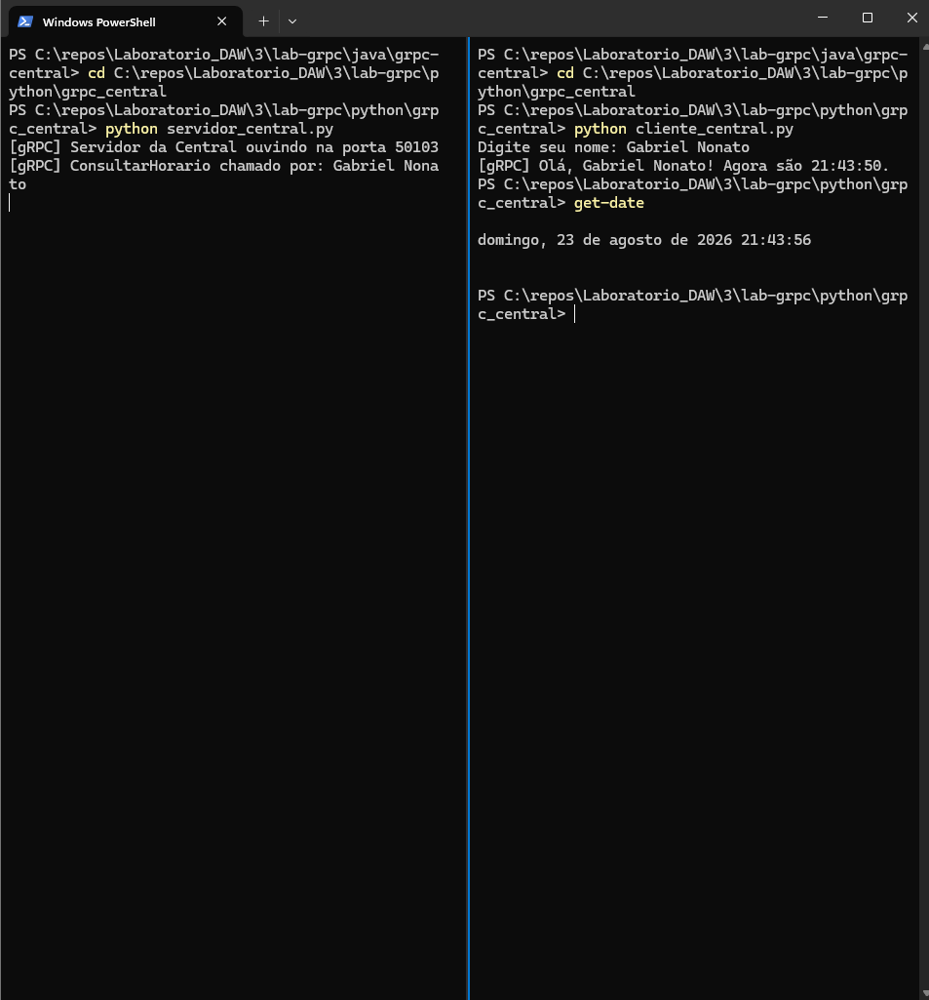
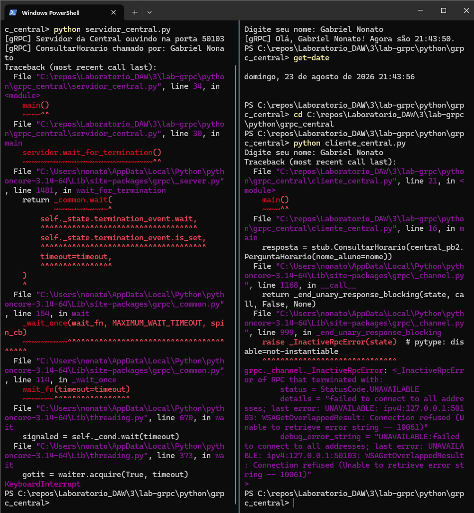
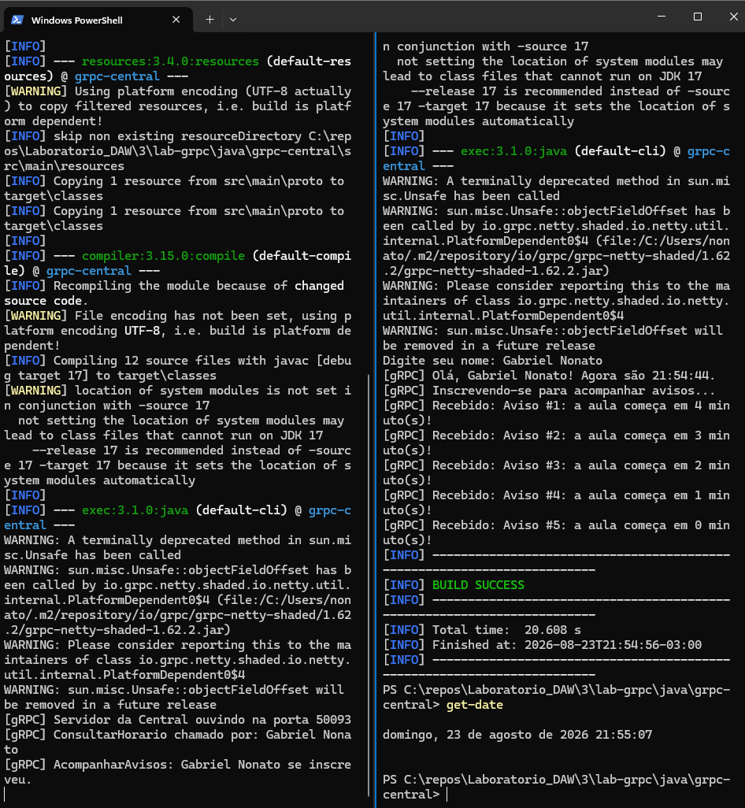
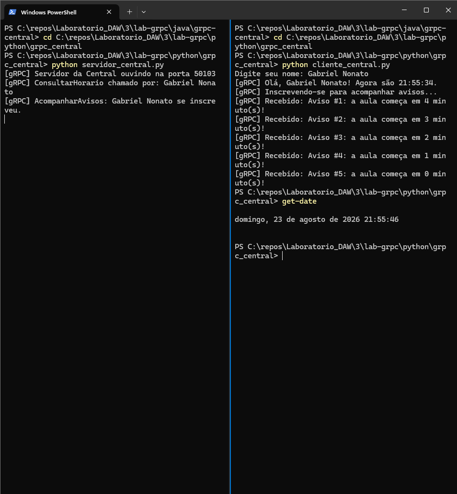

# Respostas - Roteiro 3

## Parte 4.1

### Pergunta 1

O endereço do servidor (localhost, IP, grupo multicast) está escrito diretamente no código do cliente? Isso favorece ou prejudica a transparência de localização?

Resposta:

No TCP e no UDP, o cliente usa `localhost` no código. No Multicast, o grupo `230.0.0.1` também está no código. No WebSocket, a URL com `localhost` e a porta também estão escritas no cliente. Isso prejudica a transparência de localização, pois o cliente precisa saber onde o servidor está.

### Pergunta 2

Para “perguntar uma coisa” ao servidor, o cliente precisa montar uma string de texto manualmente (e o servidor precisa interpretá-la/fazer parsing)? Isso é meio-termo, presença ou ausência de transparência de acesso?

Resposta:

No TCP, UDP e Multicast, as mensagens são montadas como texto e depois interpretadas pelo outro lado. Isso mostra pouca transparência de acesso, pois o programador precisa pensar em como enviar e ler os dados. No WebSocket isso melhora um pouco, mas ainda são usadas mensagens de texto.

### Pergunta 3

O que aconteceria com o cliente se o servidor mudasse de máquina amanhã? Alguma dessas quatro soluções sobreviveria a essa mudança sem alterar o código-fonte do cliente?

Resposta:

Se o servidor mudasse de máquina, seria preciso trocar o endereço no código do cliente. Do jeito que foram feitas, nenhuma das quatro soluções continuaria funcionando sem alterar o cliente, pois os endereços estão escritos diretamente no código.

## Parte 4.3

### Pergunta 1

Dentre os 8 tipos de transparência listados, qual você diria que é a mais visível para o programador que está usando um serviço remoto (e não construindo a infraestrutura por trás dele)? Justifique.

Resposta:

A transparência de localização é a mais visível. Isso porque, no laboratório anterior, foi necessário escrever no código o endereço do servidor, como `localhost`, IP ou grupo multicast. Se o endereço muda, o cliente também precisa mudar.

### Pergunta 2

Transparência total é sempre desejável? Dê um exemplo (pode ser hipotético) de uma situação em que esconder completamente que uma operação é remota atrapalharia mais do que ajudaria.

Resposta:

Não. Uma operação remota pode demorar mais ou falhar por causa da rede. Se isso ficar totalmente escondido, o programa pode parecer travado e o usuário não vai entender o que aconteceu. Por isso, é importante tratar tempo de espera e erros de conexão.

### Pergunta 3

(Responder depois de concluir as Partes C e D) Comparando o cliente TCP do laboratório anterior com o cliente gRPC que você vai construir agora: qual dos dois exige que você “pense em rede” (sockets, send/receive, parsing de string) e qual permite que você “pense no problema” (chamar uma função e receber um resultado)? A que tipo de transparência isso se relaciona?

Resposta:

O cliente TCP exige pensar em rede, pois precisa criar socket, enviar dados e interpretar as mensagens. No gRPC, o cliente chama métodos como `ConsultarHorario` e `AcompanharAvisos`, sem montar as mensagens manualmente. Isso mostra a transparência de acesso.

## Parte 5 - Protocol Buffers e contrato do serviço

### Pergunta 1

Qual a vantagem de ter o contrato explícito e gerado automaticamente em vez de combinado apenas “de boca”?

Resposta:

O arquivo `central.proto` deixa claro quais mensagens e operações existem. Assim, cliente e servidor seguem o mesmo padrão e fica mais difícil um lado enviar algo diferente do que o outro espera.

### Pergunta 2

O que o mesmo arquivo `central.proto` gerar código para Java e Python sugere?

Resposta:

Isso mostra que programas feitos em linguagens diferentes conseguem se comunicar. Os dois usam o mesmo contrato e o gRPC gera o código necessário para cada linguagem.

### Pergunta 3

Onde ficam definidas as operações ConsultarHorario e AcompanharAvisos nos arquivos gerados?

Resposta:

No Java, elas aparecem na classe `CentralAtendimentoGrpc`, nos métodos `getConsultarHorarioMethod()` e `getAcompanharAvisosMethod()`. No Python, elas aparecem no arquivo `central_pb2_grpc.py`.

## Parte 6 - RPC unário: ConsultarHorario

### Pergunta 1

Cite pelo menos três coisas que acontecem por baixo dos panos entre a chamada do cliente e a resposta do servidor.

Resposta:

Primeiro, o gRPC transforma a pergunta em dados para enviar pela rede. Depois, ele envia esses dados para o servidor usando HTTP/2. O servidor chama o método `ConsultarHorario`, cria a resposta e o gRPC envia essa resposta de volta para o cliente.

### Pergunta 2

Compare esta implementação com o ClienteTCP do laboratório anterior. Onde estava o equivalente a montar a mensagem e interpretar a resposta? Quem faz esse trabalho agora?

Resposta:

No TCP, o cliente montava a mensagem com texto e enviava usando o socket. Depois, ele precisava ler e interpretar a resposta recebida. Agora, o gRPC e os arquivos gerados pelo `central.proto` fazem esse trabalho automaticamente.

### Pergunta 3

O que aconteceu ao chamar ConsultarHorario com o servidor desligado?

Resposta:

Com o servidor desligado, o cliente mostrou erro de conexão recusada. No Java apareceu `UNAVAILABLE: Connection refused` e no Python apareceu `StatusCode.UNAVAILABLE`. Isso acontece porque não havia nenhum servidor ouvindo nas portas 50093 e 50103.

### Evidências de teste

#### Java

Servidor ligado:

Servidor desligado:

#### Python

Servidor ligado:

Servidor desligado:

## Parte 7 - RPC com streaming: AcompanharAvisos

### Pergunta 1

O que precisaria mudar para vários clientes gRPC receberem os mesmos avisos ao mesmo tempo?

Resposta:

O servidor precisaria guardar os clientes que estão inscritos no streaming. Quando criasse um aviso, ele teria que enviar esse mesmo aviso para cada cliente conectado.

### Pergunta 2

Compare o streaming em Java com o streaming em Python. Qual abordagem foi mais natural de entender?

Resposta:

Eu achei o Python mais natural de entender, pois o `yield` mostra de forma direta cada aviso sendo enviado. No Java, o `StreamObserver` faz a mesma coisa usando `onNext()`, mas tem mais código.

### Pergunta 3

O que aconteceria se o cliente fechasse a conexão no meio do envio dos avisos?

Resposta:

O cliente pararia de receber os avisos e o gRPC cancelaria aquela chamada. O servidor deveria perceber o cancelamento e parar de enviar os próximos avisos. No código atual, seria necessário adicionar uma verificação para interromper o laço assim que o cliente sair.

### Evidências de teste

#### Java

#### Python

Relatorio feito com apoio da ia para escrita e revisão.